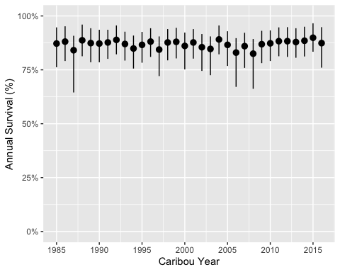
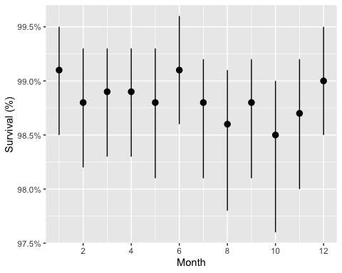
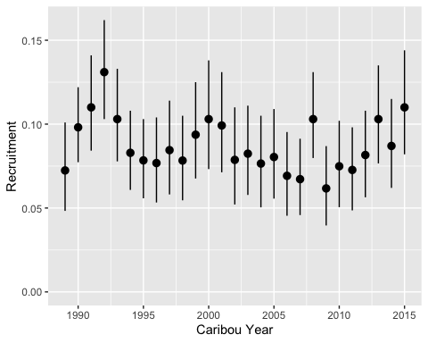
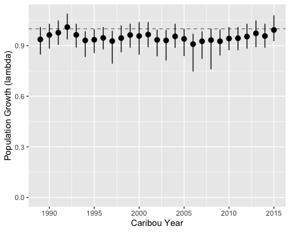
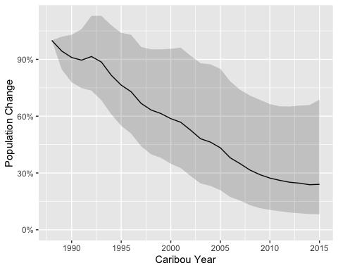

<!-- README.md is generated from README.Rmd. Please edit that file -->

# bboutools

<!-- badges: start -->

[](https://lifecycle.r-lib.org/articles/stages.html#stable)
[](https://github.com/poissonconsulting/bboutools/actions/workflows/R-CMD-check.yaml)
[](https://app.codecov.io/gh/poissonconsulting/bboutools)
<!-- badges: end -->

`bboutools` is an R package to estimate the annual survival, recruitment
and population growth for boreal caribou populations using Bayesian and
Maximum Likelihood models with fixed and random effects. It was
developed to facilitate direct comparison of estimates across
jurisdictions.

## Installation

To install the latest development version:

``` r
# install.packages("remotes")
remotes::install_github("poissonconsulting/bboutools")
```

## Introduction

### Survival

`bboutools` accepts survival data for a single population in a specific
format.

``` r
library(tibble) # for printing data frames
library(ggplot2) # for plotting

library(bboudata) # for boreal caribou datasets
#> 
#> Attaching package: 'bboudata'
#> The following object is masked from 'package:bboutools':
#> 
#>     licensing_md
library(bboutools)

surv_data <- bboudata::bbousurv_a
head(surv_data)
#> # A tibble: 6 × 6
#>   PopulationName  Year Month StartTotal MortalitiesCertain MortalitiesUncertain
#>   <chr>          <int> <int>      <int>              <int>                <int>
#> 1 A               1986     1          0                  0                    0
#> 2 A               1986     2          8                  0                    0
#> 3 A               1986     3          8                  0                    0
#> 4 A               1986     4          8                  0                    0
#> 5 A               1986     5          8                  0                    0
#> 6 A               1986     6          8                  0                    0
```

The survival model, which includes a random effect of month, is fitted
using `bb_fit_survival()`. To achieve convergence increase `nthin`.

``` r
set.seed(99)
surv_fit <- bb_fit_survival(surv_data, quiet = TRUE)
glance(surv_fit)
#> # A tibble: 1 × 8
#>       n     K nchains niters nthin   ess  rhat converged
#>   <int> <int>   <int>  <int> <dbl> <int> <dbl> <lgl>    
#> 1   363     5       3   1000    10   111  1.03 TRUE
```

Predictions can then be generated using `bb_predict_survival()`.

``` r
surv_pred <- bb_predict_survival(surv_fit)
surv_pred
#> # A tibble: 32 × 6
#>    PopulationName CaribouYear Month estimate lower upper
#>    <chr>                <int> <int>    <dbl> <dbl> <dbl>
#>  1 A                     1985    NA    0.872 0.762 0.947
#>  2 A                     1986    NA    0.881 0.791 0.952
#>  3 A                     1987    NA    0.841 0.645 0.908
#>  4 A                     1988    NA    0.887 0.813 0.96 
#>  5 A                     1989    NA    0.874 0.785 0.943
#>  6 A                     1990    NA    0.872 0.785 0.936
#>  7 A                     1991    NA    0.877 0.801 0.936
#>  8 A                     1992    NA    0.889 0.822 0.956
#>  9 A                     1993    NA    0.87  0.793 0.927
#> 10 A                     1994    NA    0.849 0.756 0.909
#> # ℹ 22 more rows
```

And plotted using `bb_plot_year()`

``` r
bb_plot_year_survival(surv_pred) +
  expand_limits(y = c(0, 1))
```

<!-- -->

The survival in each month can be plotted using `bb_plot_month()`

``` r
bb_plot_month_survival(surv_fit)
```

<!-- -->

These estimates represent the annual survival rate if that month lasted
the whole year.

### Recruitment

The equivalent functions for recruitment data are

``` r
recruit_data <- bboudata::bbourecruit_a
head(recruit_data)
#> # A tibble: 6 × 9
#>   PopulationName  Year Month   Day  Cows Bulls UnknownAdults Yearlings Calves
#>   <chr>          <int> <int> <int> <int> <int>         <int>     <int>  <int>
#> 1 A               1990     3     9     1     1             0         0      0
#> 2 A               1990     3     9     5     1             0         0      0
#> 3 A               1990     3     9     4     1             0         0      0
#> 4 A               1990     3     9     2     0             0         0      0
#> 5 A               1990     3     9     6     0             0         0      0
#> 6 A               1990     3     9     4     1             0         0      0

set.seed(99)
recruit_fit <- bb_fit_recruitment(recruit_data, quiet = TRUE)

bb_plot_year_recruitment(recruit_fit)
```

<!-- -->

### Population Growth

The function `bb_predict_growth()` predicts the annual population growth
(lambda) rate from the survival and recruitment models.

``` r
lambda <- bb_predict_growth(surv_fit, recruit_fit)
bb_plot_year_growth(lambda)
```

<!-- -->

`bb_predict_population_change()` calculates the population change (%)
with uncertainty as the cumulative product of population growth.

``` r
change <- bb_predict_population_change(surv_fit, recruit_fit)
bb_plot_year_population_change(change)
```

<!-- -->

## Information

Additional information is available from the [bboutools
website](https://poissonconsulting.github.io/bboutools/), which includes
the following articles:  
- [Get
Started](https://poissonconsulting.github.io/bboutools/articles/bboutools.html).  
- [Analytic Methods for Estimation of Boreal Caribou Survival,
Recruitment and Population
Growth](https://poissonconsulting.github.io/bboutools/articles/bbmethods.html).  
- [Prior Selection and
Influence](https://poissonconsulting.github.io/bboutools/articles/priors.html).

There is also a [user-friendly graphical
interface](https://poissonconsulting.shinyapps.io/bboushiny/), called
[`bboushiny`](https://github.com/poissonconsulting/bboushiny), for non-R
users.

## bbou Suite

`bboutools` is part of the bbou suite of tools. Other packages in this
suite include:

- [bboudata](https://github.com/poissonconsulting/bboudata)
- [bbouretro](https://github.com/poissonconsulting/bbouretro)
- [bboushiny](https://github.com/poissonconsulting/bboushiny)
- [bbousims](https://github.com/poissonconsulting/bbousims)

## Contribution

Please report any
[issues](https://github.com/poissonconsulting/bboutools/issues).

[Pull requests](https://github.com/poissonconsulting/bboutools/pulls)
are always welcome.

## Code of Conduct

Please note that the `bboutools` project is released with a [Contributor
Code of
Conduct](https://poissonconsulting.github.io/bboutools/CODE_OF_CONDUCT.html).
By contributing to this project, you agree to abide by its terms.

## Licensing

Copyright 2022-2023 Integrated Ecological Research and Poisson
Consulting Ltd.  
Copyright 2024 Province of Alberta  

The documentation is released under the [CC BY 4.0
License](https://creativecommons.org/licenses/by/4.0/)

The code is released under the [Apache License
2.0](https://www.apache.org/licenses/LICENSE-2.0)
