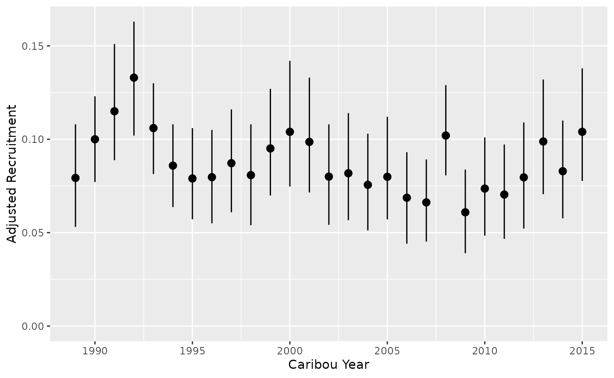
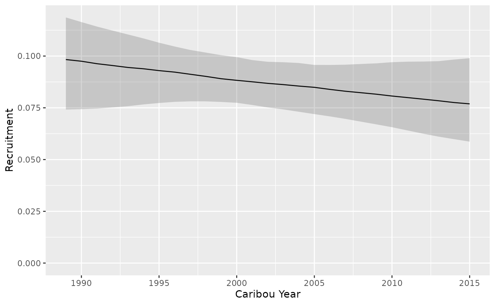
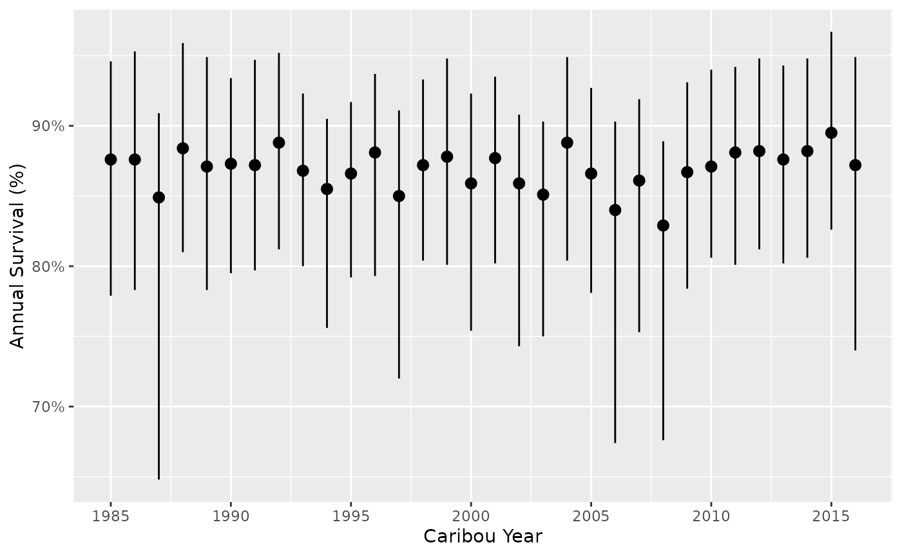
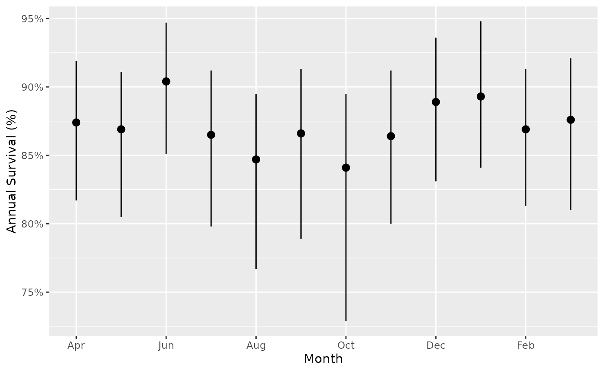
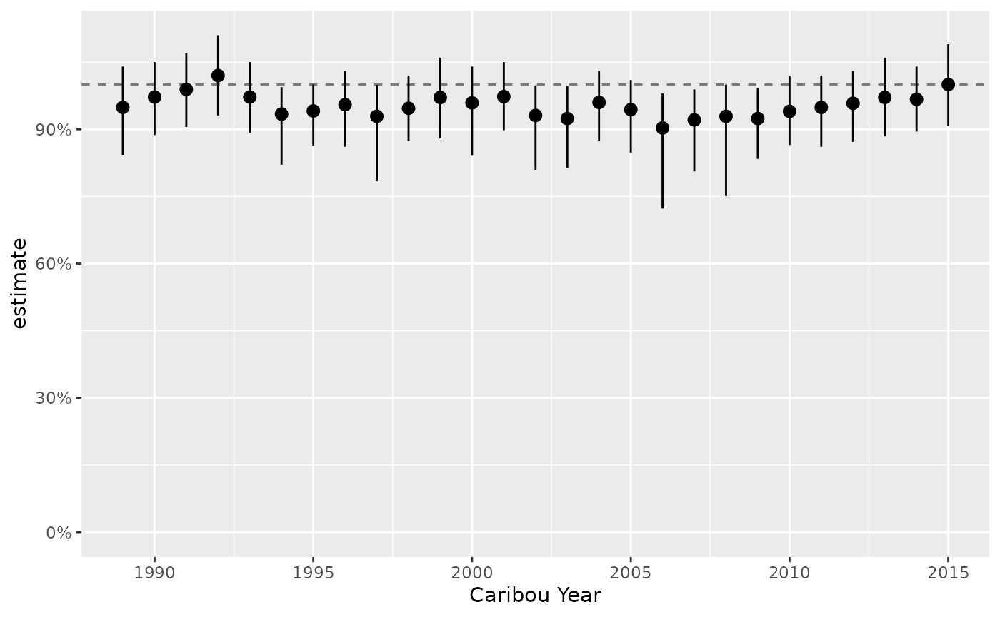
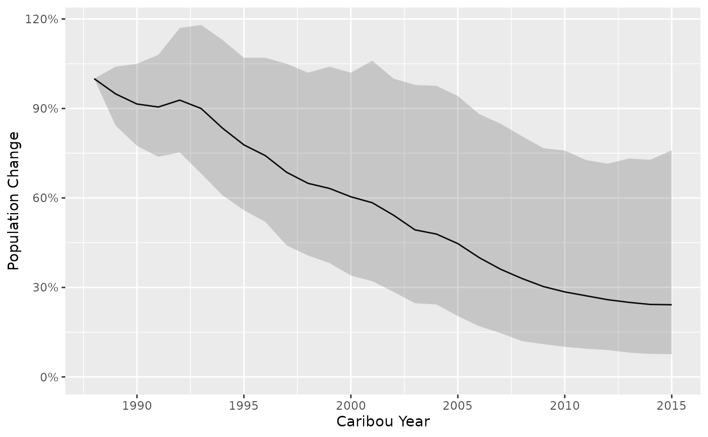
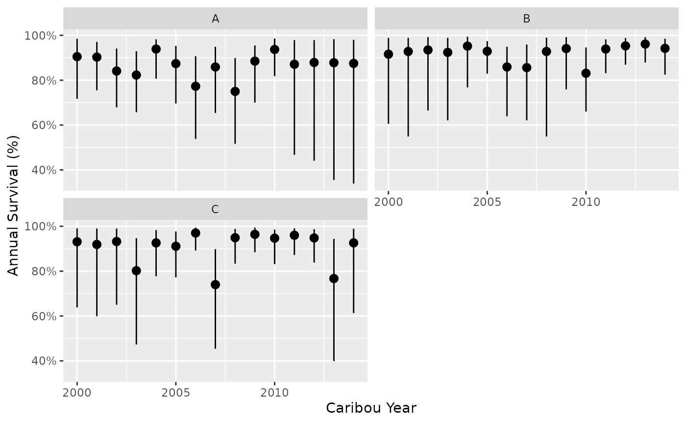
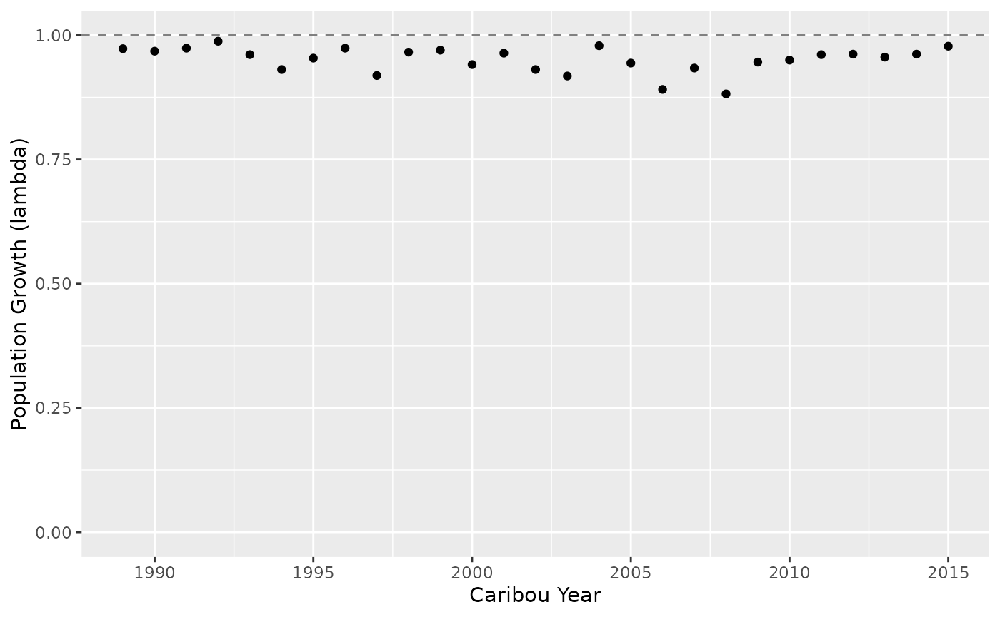

# Getting Started with bboutools

``` r
library(bboutools)
library(bboudata)
```

`bboutools` is an R package to estimate Boreal Caribou recruitment,
survival and population growth. Functions are provided to fit Bayesian
or Maximum Likelihood (ML) models and generate and plot predictions.

Under the hood, the [Nimble](https://r-nimble.org) R package is used to
fit heirarchical Bayesian and Maximum Likelihood models. Model templates
in Nimble use BUGS-like syntax.

Several anonymized data sets are provided in a separate R package,
`bboudata`.

In order to use `bboutools` you need to install R (see below) or use the
Shiny [app](https://github.com/poissonconsulting/bboushiny).

## Philosophy

`bboutools` is intended to be used in conjunction with
[tidyverse](https://www.tidyverse.org) packages such as `readr`, `dplyr`
to manipulate data and `ggplot2` (Wickham 2016) to plot data. As such,
it endeavors to fulfill the tidyverse
[manifesto](https://tidyverse.tidyverse.org/articles/manifesto.html).

## Installation

In order to install R (R Core Team 2023) the appropriate binary for the
users operating system should be downloaded from
[CRAN](https://cran.r-project.org) and then installed.

Once R is installed, the `bboutools` package can be installed from
GitHub by executing the following code at the R console

``` r
install.packages("remotes")
remotes::install_github("poissonconsulting/bboutools")
```

The `bboutools` package can then be loaded into the current session
using

``` r
library(bboutools)
```

## Getting Help

To get additional information on a particular function just type `?`
followed by the name of the function at the R console. For example
[`?bb_fit_recruitment`](https://poissonconsulting.github.io/bboutools/reference/bb_fit_recruitment.md)
brings up the R documentation for the `bboutools` recruitment model fit
function.

For more information on using R the reader is referred to [R for Data
Science](https://r4ds.had.co.nz) (Wickham and Grolemund 2016).

If you discover a bug in `bboutools` please file an issue with a
[reprex](https://reprex.tidyverse.org/articles/reprex-dos-and-donts.html)
(reproducible example) at
<https://github.com/poissonconsulting/bboutools/issues>.

## Providing Data

Once the `bboutools` package has been loaded, the next task is to
provide some data. An easy way to do this is to create a comma separated
file (`.csv`) with spreadsheet software. Recruitment and survival data
should be formatted as in the following anonymized datasets and can be
checked to confirm it is in the correct format by using the `bboudata`
functions:

``` r
# Recruitment data
bboudata::bbd_chk_data_recruitment(bboudata::bbourecruit_a)
bboudata::bbourecruit_a
#> # A tibble: 696 × 9
#>    PopulationName  Year Month   Day  Cows Bulls UnknownAdults Yearlings Calves
#>    <chr>          <int> <int> <int> <int> <int>         <int>     <int>  <int>
#>  1 A               1990     3     9     1     1             0         0      0
#>  2 A               1990     3     9     5     1             0         0      0
#>  3 A               1990     3     9     4     1             0         0      0
#>  4 A               1990     3     9     2     0             0         0      0
#>  5 A               1990     3     9     6     0             0         0      0
#>  6 A               1990     3     9     4     1             0         0      0
#>  7 A               1990     3     9     5     0             0         0      0
#>  8 A               1990     3     9     2     0             0         0      0
#>  9 A               1990     3     9     3     2             0         0      1
#> 10 A               1990     3     9     4     0             0         0      1
#> # ℹ 686 more rows
```

``` r
# Survival data
bboudata::bbd_chk_data_survival(bboudata::bbousurv_a)
bboudata::bbousurv_a
#> # A tibble: 364 × 6
#>    PopulationName  Year Month StartTotal MortalitiesCertain MortalitiesUncertain
#>    <chr>          <int> <int>      <int>              <int>                <int>
#>  1 A               1986     1          0                  0                    0
#>  2 A               1986     2          8                  0                    0
#>  3 A               1986     3          8                  0                    0
#>  4 A               1986     4          8                  0                    0
#>  5 A               1986     5          8                  0                    0
#>  6 A               1986     6          8                  0                    0
#>  7 A               1986     7          8                  0                    0
#>  8 A               1986     8          8                  0                    0
#>  9 A               1986     9          8                  0                    0
#> 10 A               1986    10          8                  0                    0
#> # ℹ 354 more rows
```

All columns should be included and column names should not be changed.

Both survival and recruitment data can include multiple populations
(different `PopulationName` values). Survival data can also be provided
as one row per population per year (aggregate annual data). Placeholder
rows with `NA` measurement columns can be added for unobserved years
with `allow_missing = TRUE`. See the [extensions
article](https://poissonconsulting.github.io/bboutools/articles/extensions.html)
for details.

The `.csv` file can then be read into R using the following

``` r
data <- read_csv(file = "path/to/file.csv")
```

## Recruitment

The annual recruitment in boreal caribou population is typically
estimated from annual calf:cow ratios.

`bboutools` fits a Binomial recruitment model to the annual counts of
calves, cows, yearlings, unknown adults and potentially, bulls.

It is up to the user to ensure that the data are from surveys that were
conducted at the same time of year, when calf survival is expected to be
similar to adult survival.

### Fit a Bayesian model

The function
[`bb_fit_recruitment()`](https://poissonconsulting.github.io/bboutools/reference/bb_fit_recruitment.md)
fits a Bayesian recruitment model.

The start month of the biological year (i.e., ‘caribou year’) can be set
with the `year_start` argument. By default, the start month is April.
Data are aggregated by biological year (not calendar year) prior to
model fitting.

The adult female proportion can either be fixed or estimated from counts
of cows and bulls (i.e.,
`Cows ~ Binomial(adult_female_proportion, Cows + Bulls)`).

If the user provides a value to `adult_female_proportion`, it is fixed.
The default value is 0.65, which accounts for higher mortality of males
(Smith 2004). If `adult_female_proportion = NULL`, the adult female
proportion is estimated from the data (i.e.,
`Cows ~ Binomial(adult_female_proportion, Cows + Bulls)`). By default, a
biologically informative prior of `Beta(65,35)` is used. This
corresponds to an expected value of 65%.

The yearling and calf female proportion can be set with `sex_ratio`. The
default value is 0.5.

The model can be fit with random effect of year, fixed effect of year
and/or continuous effect of year (i.e., year trend). The
`min_random_year` argument dictates the minimum number of years in the
dataset required to fit a random year effect; otherwise a fixed year
effect is fit. It is not recommended to fit a random year effect with
fewer than 5 years (Kery and Schaub 2011). A continuous fixed effect of
year can be fit with `year_trend = TRUE`.

The user can set `quiet = FALSE` argument to see messages and sampling
progress.

``` r
recruitment <- bb_fit_recruitment(bboudata::bbourecruit_a, year_start = 4, year_trend = TRUE, quiet = TRUE)
```

### Convergence

Model convergence can be checked with the
[`glance()`](https://generics.r-lib.org/reference/glance.html) function.

``` r
glance(recruitment)
#> Registered S3 method overwritten by 'mcmcr':
#>   method         from 
#>   as.mcmc.nlists nlist
#> # A tibble: 1 × 8
#>       n     K nchains niters nthin   ess  rhat converged
#>   <int> <int>   <int>  <int> <dbl> <int> <dbl> <lgl>    
#> 1    27     4       3    100    20   152  1.01 TRUE
```

Model convergence provides an indication of whether the parameter
estimates are reliable. Convergence is considered successful by default
if `rhat` \< 1.05. The `rhat` threshold can be adjusted by the user.
`rhat` evaluates whether the chains agree on the same values. As the
total variance of all the chains shrinks to the average variance within
chains, r-hat approaches 1.  
Output of [`glance()`](https://generics.r-lib.org/reference/glance.html)
also includes `ess` (Effective Sample Size), which represents the length
of a chain (i.e., number of iterations) if each sample was independent
of the one before it.

By default, the `bboutools` Bayesian method saves 1,000 MCMC samples
from each of three chains (after discarding the first halves). The
number of samples saved can be adjusted with the `niters` argument. With
`niters` set, the user can simply increment the thinning rate as
required to achieve convergence (i.e., by decreasing `rhat`).

### Summary

Various generic functions in `bboutools` can be used to summarize or
interrogate the output of model fitting functions.

- [`coef()`](https://rdrr.io/r/stats/coef.html) and
  [`tidy()`](https://generics.r-lib.org/reference/tidy.html) provide a
  tidy table of the coefficient estimates.
- [`estimates()`](https://poissonconsulting.github.io/universals/reference/estimates.html)
  provides a list of the coefficient estimates.
- [`augment()`](https://generics.r-lib.org/reference/augment.html)
  provides the data used.
- [`model_code()`](https://poissonconsulting.github.io/bboutools/reference/model_code.md)
  provides the model code in BUGS-like syntax.
- [`plot()`](https://rdrr.io/r/graphics/plot.default.html) provides
  traceplots for individual parameters.

The user can exclude individual random effect estimates from coefficient
output.

``` r
tidy(recruitment, include_random_effects = FALSE)
#> # A tibble: 3 × 4
#>   term    estimate  lower   upper
#>   <term>     <dbl>  <dbl>   <dbl>
#> 1 b0        -1.45  -1.64  -1.29  
#> 2 bYear     -0.103 -0.258  0.0851
#> 3 sAnnual    0.327  0.182  0.5
```

Keep in mind that any reference to ‘Year’ or ‘Annual’ in these summary
outputs represent the caribou year, which can be set by the user within
the fitting functions.

### Priors

In general, weakly informative priors are used by default (Gelman,
Simpson, and Betancourt 2017; McElreath 2016). The default prior
distribution parameter values can be accessed from
[`bb_priors_recruitment()`](https://poissonconsulting.github.io/bboutools/reference/bb_priors_recruitment.md)
and
[`bb_priors_survival()`](https://poissonconsulting.github.io/bboutools/reference/bb_priors_survival.md).
See the [priors
article](https://poissonconsulting.github.io/bboutools/articles/priors.html)
for more information.

``` r
bb_priors_recruitment()
#>                         b0_mu                         b0_sd 
#>                            -1                             5 
#>                      bYear_mu                      bYear_sd 
#>                             0                             2 
#>                    bAnnual_sd                  sAnnual_rate 
#>                             5                             1 
#> adult_female_proportion_alpha  adult_female_proportion_beta 
#>                            65                            35
```

The default prior distribution for adult_female_proportion is
`Beta(65, 35)` and the default prior distribution for the intercept
(`b0`) is `Normal(-1.5, 1)`, which is on the log scale. The user can
change the priors by providing a named vector to the `priors` argument
in the model fitting functions. The names must match one of the names in
[`bb_priors_recruitment()`](https://poissonconsulting.github.io/bboutools/reference/bb_priors_recruitment.md).

For example, less informative priors for `adult_female_proportion`
(e.g., `Beta(1, 1)`) and `b0` (e.g., `Normal(0, 5)`) can be supplied as
follows.

``` r
recruitment <- bb_fit_recruitment(bboudata::bbourecruit_a, priors = c(adult_female_proportion_alpha = 1, adult_female_proportion_beta = 1, b0_mu = 0, b0_sd = 5))
```

The user can also specify priors informed by national
demographic-disturbance relationships (Johnson et al. 2020) using
[`bb_priors_survival_national()`](https://poissonconsulting.github.io/bboutools/reference/bb_priors_survival_national.md)
and
[`bb_priors_recruitment_national()`](https://poissonconsulting.github.io/bboutools/reference/bb_priors_recruitment_national.md).
These functions return intercept priors based on the level of
anthropogenic and fire disturbance.

``` r
nat_priors <- bb_priors_recruitment_national(anthro = 50, fire_excl_anthro = 5)
recruitment_nat <- bb_fit_recruitment(bboudata::bbourecruit_a, priors = nat_priors, quiet = TRUE)
```

See the [priors
article](https://poissonconsulting.github.io/bboutools/articles/priors.html)
for more information.

If the user is interested in fitting models without any prior
information, see
[`bb_fit_recruitment_ml()`](https://poissonconsulting.github.io/bboutools/reference/bb_fit_recruitment_ml.md)
and
[`bb_fit_survival_ml()`](https://poissonconsulting.github.io/bboutools/reference/bb_fit_survival_ml.md),
which use a Maximum Likelihood approach (see [Maximum
Likelihood](#maximum-likelihood) below).

## Survival

The annual survival in boreal caribou population is typically estimated
from the monthly fates of collared adult females. `bboutools` fits a
Binomial monthly survival model to the number of collared females and
mortalities. The user can choose whether to include individuals with
uncertain fates with the certain mortalities.

The function
[`bb_fit_survival()`](https://poissonconsulting.github.io/bboutools/reference/bb_fit_survival.md)
fits a Bayesian survival model.

The survival model is always fit with a random intercept for each month.
Otherwise, the `year_start`, `year_trend`, and `min_random_year`
arguments have the same behaviour as
[`bb_fit_recruitment()`](https://poissonconsulting.github.io/bboutools/reference/bb_fit_recruitment.md)
above.

If `include_uncertain_mortalities = TRUE`, the total mortalities is the
sum of the certain mortalities and uncertain mortalities
(‘MortalitiesCertain’ and ‘MortalitiesUncertain’ columns); otherwise,
only certain mortalities are used to fit the model.

``` r
survival <- bb_fit_survival(bboudata::bbousurv_a, year_start = 4, quiet = TRUE)
```

``` r
tidy(survival, include_random_effects = FALSE)
#> # A tibble: 4 × 4
#>   term    estimate  lower upper
#>   <term>     <dbl>  <dbl> <dbl>
#> 1 b0         4.46  4.17   4.81 
#> 2 bYear      0     0      0    
#> 3 sAnnual    0.308 0.0153 0.671
#> 4 sMonth     0.26  0.0468 0.61
```

## Predictions

A user can generate and plot predictions of recruitment, survival and
population growth.

Recruitment is the adjusted recruitment using methods from (DeCesare et
al. 2012). See the [analytical methods
article](https://poissonconsulting.github.io/bboutools/articles/methods.html)
for details.

Predictions of calf-cow ratio can also be made using
[`bb_predict_calf_cow_ratio()`](https://poissonconsulting.github.io/bboutools/reference/bb_predict_calf_cow_ratio.md).

The sex ratio is set at fit time via the `sex_ratio` argument in
[`bb_fit_recruitment()`](https://poissonconsulting.github.io/bboutools/reference/bb_fit_recruitment.md)
and is automatically extracted by predict functions.

#### Recruitment by year

``` r
predict_recruitment <- bb_predict_recruitment(recruitment, year = TRUE)
bb_plot_year_recruitment(predict_recruitment)
```



#### Recruitment for a ‘typical’ year

``` r
predict_recruitment_1 <- bb_predict_recruitment(recruitment, year = FALSE)
predict_recruitment_1
#> # A tibble: 1 × 6
#>   PopulationName CaribouYear Month estimate  lower  upper
#>   <fct>                <int> <int>    <dbl>  <dbl>  <dbl>
#> 1 A                       NA    NA   0.0868 0.0752 0.0972
```

#### Recruitment trend

``` r
predict_recruitment_trend <- bb_predict_recruitment_trend(recruitment)
bb_plot_year_trend_recruitment(predict_recruitment_trend)
```



#### Survival by year for a ‘typical’ month

``` r
predict_survival <- bb_predict_survival(survival, year = TRUE, month = FALSE)
bb_plot_year_survival(predict_survival)
```



#### Survival by month for a ‘typical’ year

The estimates show annual survival, i.e., if that month lasted the
duration of the year.

``` r
predict_survival_month <- bb_predict_survival(survival, year = FALSE, month = TRUE)
bb_plot_month_survival(predict_survival_month)
```



## Population Growth

A user can predict population growth (lambda) with
[`bb_predict_growth()`](https://poissonconsulting.github.io/bboutools/reference/bb_predict_growth.md).
The survival and recruitment models fit in the previous steps are used
as input. It is important to ensure that survival and recruitment
outputs share the same biological year (i.e., ‘caribou year’), which is
set with the `year_start` argument in
[`bb_fit_survival()`](https://poissonconsulting.github.io/bboutools/reference/bb_fit_survival.md)
and
[`bb_fit_recruitment()`](https://poissonconsulting.github.io/bboutools/reference/bb_fit_recruitment.md).
Details on how lambda is calculated can be found in the [analytical
methods
article](https://poissonconsulting.github.io/bboutools/articles/methods.html).

``` r
predict_lambda <- bb_predict_growth(survival = survival, recruitment = recruitment)
#> Filtering to shared population and year combinations. CaribouYears in survival only: 1985, 1986, 1987, 1988, 2016.

bb_plot_year_growth(predict_lambda) +
  ggplot2::scale_y_continuous(labels = scales::percent)
#> Scale for y is already present.
#> Adding another scale for y, which will replace the existing scale.
```



Population change (%) is calculated with uncertainty as the cumulative
product of population growth.

``` r
predict_change <- bb_predict_population_change(survival = survival, recruitment = recruitment)
#> Filtering to shared population and year combinations. CaribouYears in survival only: 1985, 1986, 1987, 1988, 2016.
bb_plot_year_population_change(predict_change)
```



## Multi-Population Analysis

`bboutools` can fit models to data from multiple populations
simultaneously. The function
[`bb_fit_survival()`](https://poissonconsulting.github.io/bboutools/reference/bb_fit_survival.md)
auto-detects multiple populations from the `PopulationName` column.

``` r
survival_multi <- bb_fit_survival(bboudata::bbousurv_multi, allow_missing = TRUE, quiet = TRUE)
```

Prediction plots are automatically faceted by population.

``` r
pred_multi <- bb_predict_survival(survival_multi)
bb_plot_year_survival(pred_multi)
```



The default faceting can be overridden since all plot functions return
`ggplot2` objects.

See the [extensions
article](https://poissonconsulting.github.io/bboutools/articles/extensions.html)
for more information on multi-population analysis, aggregate annual
survival data, predicting unobserved years and other extensions.

## Maximum Likelihood

Maximum Likelihood (ML) models can be fit using the
[`bb_fit_recruitment_ml()`](https://poissonconsulting.github.io/bboutools/reference/bb_fit_recruitment_ml.md)
and
[`bb_fit_survival_ml()`](https://poissonconsulting.github.io/bboutools/reference/bb_fit_survival_ml.md)
functions. These functions take a few seconds to execute because Nimble
must compile the model into C++ code. See the [Nimble
documentation](https://r-nimble.org/html_manual/cha-AD.html#how-to-use-laplace-approximation)
for more information and comparison to TMB. Similar to Bayesian model
fits, generic functions (e.g.,
[`tidy()`](https://generics.r-lib.org/reference/tidy.html),
[`glance()`](https://generics.r-lib.org/reference/glance.html) and
[`augment()`](https://generics.r-lib.org/reference/augment.html)) work
on ML fit objects (class ‘bboufit_ml’).

``` r
recruitment_ml <- bb_fit_recruitment_ml(bboudata::bbourecruit_a, year_start = 4, year_trend = TRUE, quiet = TRUE)
```

``` r
glance(recruitment_ml)
#> # A tibble: 1 × 4
#>       n     K loglik converged
#>   <int> <int>  <dbl> <lgl>    
#> 1    27     3  -90.1 TRUE
```

``` r
survival_ml <- bb_fit_survival_ml(bboudata::bbousurv_a, year_start = 4, quiet = TRUE)
```

The ML estimates are comparable to estimates derived from the equivalent
Bayesian models above. In general, ML models can be interpreted as
Bayesian models with uninformative (e.g., uniform) priors (McElreath
2016).

``` r
tidy(recruitment_ml, include_random_effects = FALSE)
#> # A tibble: 29 × 4
#>    term          estimate lower upper
#>    <chr>            <dbl> <dbl> <dbl>
#>  1 b0[1]            -1.43 -1.43 -1.43
#>  2 bAnnual[1, 1]     0     0     0   
#>  3 bAnnual[2, 1]     0     0     0   
#>  4 bAnnual[3, 1]     0     0     0   
#>  5 bAnnual[4, 1]     0     0     0   
#>  6 bAnnual[5, 1]     0     0     0   
#>  7 bAnnual[6, 1]     0     0     0   
#>  8 bAnnual[7, 1]     0     0     0   
#>  9 bAnnual[8, 1]     0     0     0   
#> 10 bAnnual[9, 1]     0     0     0   
#> # ℹ 19 more rows
```

``` r
tidy(survival_ml, include_random_effects = FALSE)
#> # A tibble: 4 × 4
#>   term     estimate  lower upper
#>   <chr>       <dbl>  <dbl> <dbl>
#> 1 b0[1]       4.45  4.45   4.45 
#> 2 bYear[1]    0     0      0    
#> 3 sAnnual     0.336 0.133  0.846
#> 4 sMonth      0.238 0.0722 0.787
```

There is functionality in `bboutools` to generate predictions (i.e.,
derived parameters) from ML models. However, there is no functionality
to get confidence intervals on predictions. This is a more
straightforward task with Bayesian models.

``` r
bb_predict_survival(survival_ml)
#> # A tibble: 32 × 6
#>    PopulationName CaribouYear Month estimate lower upper
#>    <fct>                <int> <int>    <dbl> <dbl> <dbl>
#>  1 A                     1985    NA    0.873    NA    NA
#>  2 A                     1986    NA    0.883    NA    NA
#>  3 A                     1987    NA    0.83     NA    NA
#>  4 A                     1988    NA    0.89     NA    NA
#>  5 A                     1989    NA    0.875    NA    NA
#>  6 A                     1990    NA    0.871    NA    NA
#>  7 A                     1991    NA    0.878    NA    NA
#>  8 A                     1992    NA    0.891    NA    NA
#>  9 A                     1993    NA    0.868    NA    NA
#> 10 A                     1994    NA    0.842    NA    NA
#> # ℹ 22 more rows
```

``` r
growth <- bb_predict_growth(survival_ml, recruitment_ml)
#> Filtering to shared population and year combinations. CaribouYears in survival only: 1985, 1986, 1987, 1988, 2016.
bb_plot_year_growth(growth)
```



ML models do not currently support multi-population analysis, unobserved
year predictions (`allow_missing`) or prior-only sampling. These
features are available only with the Bayesian fitting functions.

Note that ML models can struggle to converge when there are sparse data,
especially with a fixed year effect. If these issues arise, the user can
try estimating year as a random effect, continuous effect
(`year_trend`), or fitting a Bayesian model.

Another possible source of convergence issues is initial values. By
default, `bboutools` sets initial values based on the default priors
used for parameters in the Bayesian models. The user can replace initial
values for parameters using `inits`.

``` r
inits_ml <- bb_fit_recruitment_ml(bboudata::bbourecruit_a, inits = c(b0 = 1, sAnnual = 0.3))
```

## Understanding `bboufit` objects

The
[`bb_fit_survival()`](https://poissonconsulting.github.io/bboutools/reference/bb_fit_survival.md)
and
[`bb_fit_recruitment()`](https://poissonconsulting.github.io/bboutools/reference/bb_fit_recruitment.md)
functions use a Bayesian approach and return objects that inherit from
class `bboufit`.

Objects of class `bboufit` have four elements:

1.  `model` - the compiled Nimble model as created by
    [`nimble::nimbleModel()`](https://rdrr.io/pkg/nimble/man/nimbleModel.html).  
2.  `model_code` - the model code in text format.  
3.  `samples` - the MCMC samples generated
    from[`nimble::runMCMC()`](https://rdrr.io/pkg/nimble/man/runMCMC.html)
    converted to an object of class `mcmcr`.  
4.  `data` - the survival or recruitment data provided.

These are the raw materials for any further exploration or analysis. For
example, view trace and density plots with `plot(fit$samples)`.

See [mcmcr](https://github.com/poissonconsulting/mcmcr) and
[mcmcderive](https://github.com/poissonconsulting/mcmcderive) for
working with `mcmcr` objects, or convert samples to an object of class
`mcmc.list`, e,g, with
[`coda::as.mcmc.list`](https://rdrr.io/pkg/coda/man/mcmc.list.html) for
working with the [coda](https://github.com/cran/coda) R package.

The
[`bb_fit_survival_ml()`](https://poissonconsulting.github.io/bboutools/reference/bb_fit_survival_ml.md)
and
[`bb_fit_recruitment_ml()`](https://poissonconsulting.github.io/bboutools/reference/bb_fit_recruitment_ml.md)
functions use a Maximum Likelihood approach and return objects that
inherit from class `bboufit_ml`.

Objects of class `bboufit_ml` have five elements:

1.  `model` - the Nimble model as created by
    [`nimble::nimbleModel()`](https://rdrr.io/pkg/nimble/man/nimbleModel.html).  
2.  `model_code` - the model code in text format.  
3.  `mle` - the Maximum Likelihood output as created by
    model\$findMLE().
4.  `summary` - the summary of the Maximum Likelihood output as created
    by `model$summary(mle)`.  
5.  `data` - the survival or recruitment data provided.

See [nimble](https://github.com/nimble-dev/nimble) for how to work with
nimble model objects and Maximum Likelihood output.

## References

DeCesare, Nicholas J., Mark Hebblewhite, Mark Bradley, Kirby G. Smith,
David Hervieux, and Lalenia Neufeld. 2012. “Estimating Ungulate
Recruitment and Growth Rates Using Age Ratios.” *The Journal of Wildlife
Management* 76 (1): 144–53. <https://doi.org/10.1002/jwmg.244>.

Gelman, Andrew, Daniel Simpson, and Michael Betancourt. 2017. “The Prior
Can Often Only Be Understood in the Context of the Likelihood.”
*Entropy* 19 (10). <https://doi.org/10.3390/e19100555>.

Johnson, C. A., G. D. Sutherland, E. Neave, M. Leblond, P. Kirby, C.
Superbie, and P. D. McLoughlin. 2020. “Science to Inform Policy: Linking
Population Dynamics to Habitat for a Threatened Species in Canada.”
*Journal of Applied Ecology* 57 (7): 1314–27.
<https://doi.org/10.1111/1365-2664.13637>.

Kery, Marc, and Michael Schaub. 2011. *Bayesian Population Analysis
Using WinBUGS : A Hierarchical Perspective*. Boston: Academic Press.
[http://www.vogelwarte.ch/bpa.html](http://www.vogelwarte.ch/bpa.md).

McElreath, Richard. 2016. *Statistical Rethinking: A Bayesian Course
with Examples in R and Stan*. Chapman & Hall/CRC Texts in Statistical
Science Series 122. Boca Raton: CRC Press/Taylor & Francis Group.

R Core Team. 2023. *R: A Language and Environment for Statistical
Computing*. Vienna, Austria: R Foundation for Statistical Computing.
<https://www.R-project.org/>.

Smith, Kirby Gordon. 2004. “Woodland Caribou Demography and Persistence
Relative to Landscape Change in West-Central Alberta.” 125.

Wickham, Hadley. 2016. *ggplot2: Elegant Graphics for Data Analysis*.
Springer-Verlag New York. <https://ggplot2.tidyverse.org>.

Wickham, Hadley, and Garrett Grolemund. 2016. *R for Data Science:
Import, Tidy, Transform, Visualize, and Model Data*. First edition.
Sebastopol, CA: O’Reilly. <https://r4ds.had.co.nz>.
