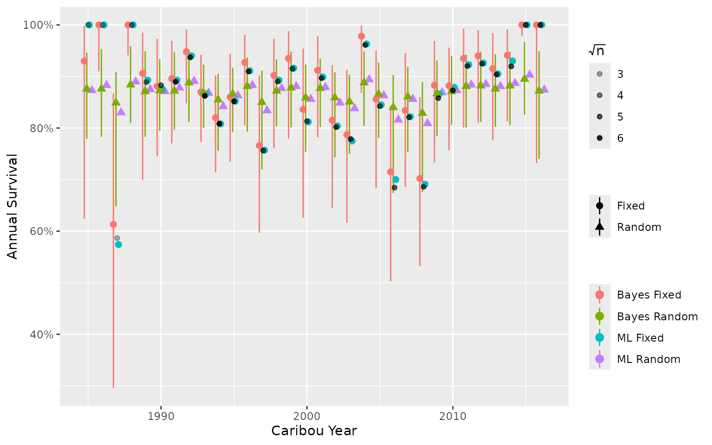

# Analytic Methods for Estimation of Boreal Caribou Survival, Recruitment and Population Growth

## Bayesian vs Frequentist Framework

The frequentist (Maximum Likelihood) framework selects the parameter
values which, if they were true, would be most likely to give rise to
the data. It assumes that all possible survival and recruitment values
are equally likely to be true prior to observing the data. The
confidence intervals (CIs) rely on asymptotic assumptions and may be
unreliable with small sample sizes.

The Bayesian framework combines the likelihood with prior probability
distributions to obtain the posterior probability of the parameter
values given the data (McElreath 2016). It allows incorporation of
biological knowledge through the specification of informative priors.
The credible intervals (CIs) represent the actual uncertainty in the
parameter values given the data and the priors, irrespective of the
sample size.

Most models can be fit in a Bayesian or frequentist framework.

## Fixed vs Random Effects

When a categorical variable is treated as a fixed effect, each parameter
value is estimated independently. In contrast, when it is treated as a
random effect, the parameter values are assumed to be drawn from a
common normal distribution (with mean zero and an estimated standard
deviation) which allows the typical values to be estimated and each
parameter estimate to be informed by the others (Kery and Schaub 2011).

The use of random effects is especially beneficial when some
months/years have sparse or missing data. In the case of sparse data or
extreme values, estimates will tend to be pulled toward the grand mean,
a behaviour known as ‘shrinkage’ (Kery and Schaub 2011). For missing
data, the estimate will be equal to the mean. Shrinkage may not be
desired if extreme values are likely to represent the true value (e.g.,
numerous wolf attacks in one year). In this case, a fixed effect model
would yield more reliable estimates.

Fixed and random effects can be used in Bayesian or frequentist models.

## Maximum Likelihood vs Posterior Probability

The frequentist approach identifies the parameter values that maximize
the likelihood, i.e., the parameter values with the greatest probability
of having produced the observed data. Parameter estimates for random
effects can be obtained using the Laplace approximation, which
integrates over the random effects (i.e., with software packages
[TMB](https://arxiv.org/pdf/1509.00660.pdf) or
[Nimble](https://r-nimble.org/html_manual/cha-AD.html#how-to-use-laplace-approximation)).
The CIs are calculated from the standard errors using a normal
approximation to the likelihood surface. This approach has the advantage
of being fast.

The Bayesian approach multiplies the likelihood by the prior probability
of the parameter values to obtain the posterior probability distribution
of the parameter values given the data (McElreath 2016). Bayesian
methods repeatedly sample from the posterior distributions using MCMC
(Markov Chain Monte Carlo) methods. This approach has the advantage of
allowing derived parameters such as the population growth rate to be
easily estimated with full uncertainty from the primary survival and
recruitment parameters.

To demonstrate, we use an anonymized data set to compare annual survival
estimates from a:

- Bayesian model with fixed year effect.  
- Bayesian model with random year effect.  
- Maximum Likelihood model with fixed year effect.  
- Maximum Likelihood model with random year effect.

Observed data (black points) are shown as the mean monthly survival by
year, weighted by the square root of the number of collars. Transparency
of the black points shows the mean \sqrt(n).

In this example, Maximum Likelihood and Bayesian models of the same type
(i.e., fixed or random) have similar estimates because the Bayesian
model priors are not informative. Estimates from random effect models
tend to be pulled toward the mean. Estimates from the fixed effect
models more closely match the observed data, including extreme values.
Note, there is no functionality in `bboutools` to get confidence
intervals on predictions (i.e., derived parameters) for Maximum
Likelihood models. This is a more straightforward task with Bayesian
models.

## bboutools

`bboutools` provides the option to estimate parameter values using a
Maximum Likelihood or a fully Bayesian approach. Random effects are used
where appropriate by default. The Bayesian approach also uses
biologically reasonable, weakly informative priors by default (see the
[priors
article](https://poissonconsulting.github.io/bboutools/articles/priors.html)
for details). `bboutools` provides relatively simple general models that
can be used to compare survival, recruitment and population growth
estimates across jurisdictions.

By default, the `bboutools` Bayesian method saves 1,000 MCMC samples
from each of three chains (after discarding the first halves). The
number of samples saved can be adjusted with the `niters` argument. With
`niters` set, the user can simply increment the thinning rate as
required to achieve convergence. This process is automated in the Shiny
app.

### Survival Model

The survival model with annual random effect and trend is specified
below in a simplified form of the BUGS language for readability. The
same model code is used for both the Bayesian and frequentist methods.
The model is indexed by population (`k`); for single-population data,
`nPopulation = 1` and the model reduces to the original
single-population form. The standard deviations of the annual
(`sAnnual`) and month (`sMonth`) random effects are shared across
populations, allowing groups of populations to share interannual and
seasonal variation. Population-specific intercepts (`b0`), year trends
(`bYear`), annual deviations (`bAnnual`) and month deviations (`bMonth`)
are estimated independently for each population.

    for(k in 1:nPopulation) {
      b0[k] ~ Normal(3, 10)
      bYear[k] ~ Normal(0, 2)
    }

    sMonth ~ Exponential(1)
    for(i in 1:nMonth) {
      for(k in 1:nPopulation) {
        bMonth[i, k] ~ Normal(0, sMonth)
      }
    }

    sAnnual ~ Exponential(1)
    for(i in 1:nAnnual) {
      for(k in 1:nPopulation) {
        bAnnual[i, k] ~ Normal(0, sAnnual)
      }
    }

    for(i in 1:nObs) {
      logit(eSurvival[i]) = b0[PopulationName[i]] + bMonth[Month[i], PopulationName[i]]
                            + bAnnual[Annual[i], PopulationName[i]]
                            + bYear[PopulationName[i]] * Year[i]
      Mortalities[i] ~ Binomial(1 - eSurvival[i], StartTotal[i])
    }

When aggregate annual survival data is provided (one row per population
per year), `nMonth = 1`, `bMonth` is fixed to zero and the `^12`
annualization used to convert monthly to annual survival is skipped.

### Recruitment Model

The recruitment model with annual random effect and year trend is
specified below in a simplified form of the BUGS language for
readability. Group-level observations are aggregated by caribou year
prior to model fitting. As with the survival model, the recruitment
model is indexed by population (`k`) and the standard deviation of the
annual random effect (`sAnnual`) is shared across populations.

    for(k in 1:nPopulation) {
      b0[k] ~ Normal(-1, 5)
      bYear[k] ~ Normal(0, 1)
    }

    adult_female_proportion ~ Beta(65, 35)

    sAnnual ~ Exponential(1)
    for(i in 1:nAnnual) {
      for(k in 1:nPopulation) {
        bAnnual[i, k] ~ Normal(0, sAnnual)
      }
    }

    for(i in 1:nObs) {
      FemaleYearlings[i] ~ Binomial(sex_ratio, Yearlings[i])
      Cows[i] ~ Binomial(adult_female_proportion, CowsBulls[i])
      OtherAdultsFemales[i] ~ Binomial(adult_female_proportion, UnknownAdults[i])
      logit(eRecruitment[i]) <- b0[PopulationName[i]] + bAnnual[Annual[i], PopulationName[i]]
                                + bYear[PopulationName[i]] * Year[i]
      AdultsFemales[i] <- max(FemaleYearlings[i] + Cows[i] + OtherAdultsFemales[i], 1)
      Calves[i] ~ Binomial(eRecruitment[i], AdultsFemales[i])
    }

In the frequentist approach, demographic stochasticity is removed from
the model because it is not possible to estimate discrete latent
variables using Laplace approximation. This has a minimal effect on
estimates. The adjusted model with no demographic stochasticity is
specified below.

    for(k in 1:nPopulation) {
      bYear[k] ~ Normal(0, 1)
    }

    adult_female_proportion ~ Beta(65, 35)

    sAnnual ~ Exponential(1)
    for(i in 1:nAnnual) {
      for(k in 1:nPopulation) {
        bAnnual[i, k] ~ Normal(0, sAnnual)
      }
    }

    for(i in 1:nObs) {
      Cows[i] ~ Binomial(adult_female_proportion, CowsBulls[i])
      FemaleYearlings[i] <- round(sex_ratio * Yearlings[i])
      OtherAdultsFemales[i] <- round(adult_female_proportion * UnknownAdults[i])
      logit(eRecruitment[i]) <- b0[PopulationName[i]] + bAnnual[Annual[i], PopulationName[i]]
                                + bYear[PopulationName[i]] * Year[i]
      AdultsFemales[i] <- max(FemaleYearlings[i] + Cows[i] + OtherAdultsFemales[i], 1)
      Calves[i] ~ Binomial(eRecruitment[i], AdultsFemales[i])
    }

### Predicted Survival, Recruitment and Population Growth

As ungulate populations are generally polygynous survival and
recruitment are estimated with respect to the number of adult (mature)
females.

To estimate recruitment following DeCesare et al. (2012), the predicted
annual calves per female adult is first divided by two to give the
expected number of female calves per adult female (under the assumption
of a 1:1 sex ratio).

R_F = R/2

Next the annual recruitment is adjusted to give the proportional change
in the population.

R\_\Delta = \frac{R_F}{1 + R_F} The rate of population growth (\lambda)
is

\lambda = \frac{N\_{t+1}}{N_t}

where N_t is the population abundance in year t.

Following Hatter and Bergerud (1991), it can be shown that

\lambda = \frac{S}{1-R} where S is the annual survival.

\lambda is calculated from R\_\Delta and S as

\lambda = \frac{S}{1-R\_\Delta}

When survival and recruitment fits contain different populations or year
ranges,
[`bb_predict_growth()`](https://poissonconsulting.github.io/bboutools/reference/bb_predict_growth.md)
auto-filters to the intersection of shared population and year
combinations. An informative message reports what was excluded.

More reliable estimates may be produced with an Integrated Population
Model (IPM). See for example methods used in Lamb et al. (2024).
However, an IPM is beyond the scope of this software as it requires
estimates of abundance N, which is not typically available in all
jurisdictions.

## References

DeCesare, Nicholas J., Mark Hebblewhite, Mark Bradley, Kirby G. Smith,
David Hervieux, and Lalenia Neufeld. 2012. “Estimating Ungulate
Recruitment and Growth Rates Using Age Ratios.” *The Journal of Wildlife
Management* 76 (1): 144–53. <https://doi.org/10.1002/jwmg.244>.

Hatter, Ian, and Wendy Bergerud. 1991. “Moose Recuriment Adult Mortality
and Rate of Change” 27: 65–73.

Kery, Marc, and Michael Schaub. 2011. *Bayesian Population Analysis
Using WinBUGS : A Hierarchical Perspective*. Boston: Academic Press.
[http://www.vogelwarte.ch/bpa.html](http://www.vogelwarte.ch/bpa.md).

Lamb, Clayton T., Sara Williams, Stan Boutin, Michael Bridger, Deborah
Cichowski, Kristina Cornhill, Craig DeMars, et al. 2024. “Effectiveness
of Population-Based Recovery Actions for Threatened Southern Mountain
Caribou.” *Ecological Applications* 34 (4): e2965.
https://doi.org/<https://doi.org/10.1002/eap.2965>.

McElreath, Richard. 2016. *Statistical Rethinking: A Bayesian Course
with Examples in R and Stan*. Chapman & Hall/CRC Texts in Statistical
Science Series 122. Boca Raton: CRC Press/Taylor & Francis Group.
