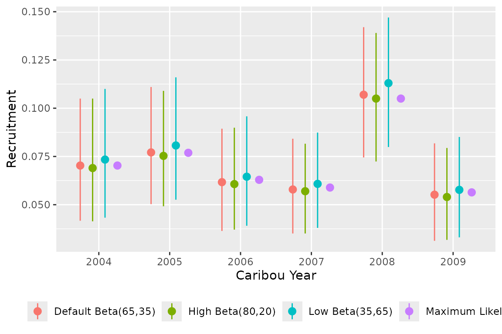
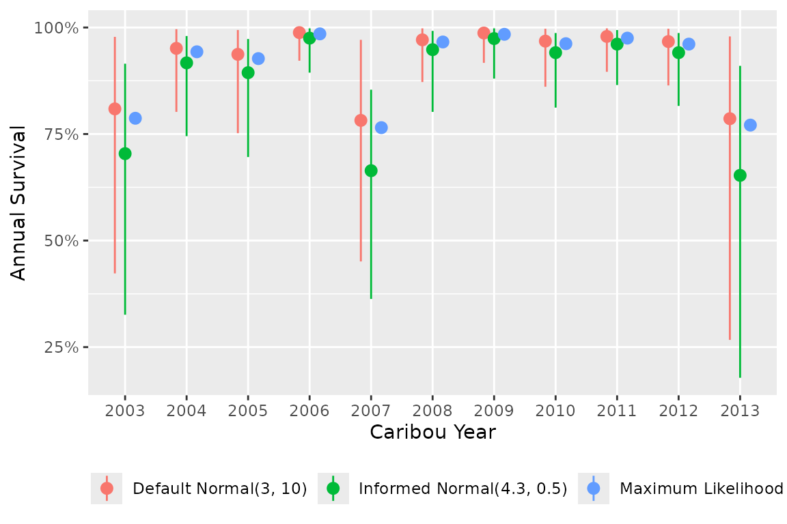
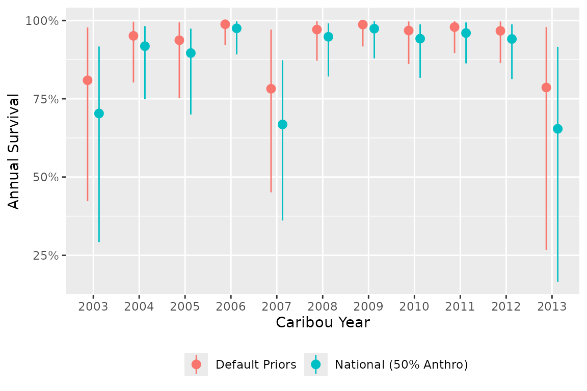

# Prior Selection and Influence

In Bayesian analysis, a prior distribution encodes what is known or
assumed about a parameter before observing the data. The prior is
combined with the likelihood of the data to produce the posterior
distribution, which represents the updated knowledge about the parameter
after observing the data. When the data are abundant, the posterior is
dominated by the likelihood and the choice of prior has little practical
effect. When the data are sparse, the prior has more influence on the
posterior, which can be beneficial if the prior reflects genuine
biological knowledge, or problematic if the prior is poorly chosen.

Priors range from uninformative (assigning equal probability to all
values) to strongly informative (concentrating probability near a
specific value). `bboutools` uses weakly informative priors by default,
which rule out biologically implausible values but remain diffuse enough
to let the data drive the estimates (Gelman, Simpson, and Betancourt
2017; McElreath 2016).

If the user is interested in fitting models without priors, see
[`bb_fit_recruitment_ml()`](https://poissonconsulting.github.io/bboutools/reference/bb_fit_recruitment_ml.md)
and
[`bb_fit_survival_ml()`](https://poissonconsulting.github.io/bboutools/reference/bb_fit_survival_ml.md),
which have identical models but use a frequentist approach (Maximum
Likelihood) to parameter estimation. Models fit with Maximum Likelihood
are equivalent to Bayesian models with completely uninformative priors
(McElreath 2016).

### Survival

Given the full model, the expected survival probability for the i^{th}
year and j^{th} month is \text{logit}(Survival\[i,j\]) = b0 +
bAnnual\[i\] + bMonth\[j\] + bYear \cdot Year\[i\] Where bAnnual can be
a fixed or random effect of categorical year on the intercept on the
log-odds scale and Year is the scaled continuous year.

This model has the following default priors in `bboutools`

- Intercept (log-odds scale) b0 \sim Normal(3, sd = 10)

- Year fixed effect bAnnual\[i\] \sim Normal(0, sd = 10)

- Year random effect sAnnual \sim Exponential(1) bAnnual \sim Normal(0,
  sd = sAnnual)

- Month random effect sMonth \sim Exponential(1) bMonth \sim Normal(0,
  sd = sMonth)

- Year continuous effect bYear \sim Normal(0, sd = 2)

### Recruitment

Given the full model, the expected recruitment (calves per adult female)
for the i^{th} year is logit(Recruitment\[i\]) = b0 + bAnnual\[i\] +
bYear \cdot Year\[i\] where bAnnual can be a fixed or random effect of
categorical year on the intercept on the log scale and Year is the
scaled continuous year.

The model has the following default priors in `bboutools`

- Intercept (log-odds scale) b0 \sim Normal(-1, sd = 5)

- Categorical year fixed effect bAnnual\[i\] \sim Normal(0, sd = 5)

- Categorical year random effect sAnnual \sim Exponential(1) bAnnual
  \sim Normal(0, sd = sAnnual)

- Continuous year effect bYear \sim Normal(0, sd = 2)

The recruitment model can also estimate the adult female proportion from
observed Cows and Bulls Cows = adult\\female\\proportion \cdot (Cows +
Bulls) Where the default prior for adult\\female\\proportion has a mode
of 65% adult\\female\\proportion \sim Beta(65, 35)

### Prior selection and influence

The default weakly informative priors are appropriate for most analyses.
A user may wish to adjust priors in several situations: when strong
biological knowledge exists for a parameter (e.g., adult female
proportion from published studies), when the dataset is small and the
user wants to constrain estimates to a plausible range, or when
comparing the sensitivity of results to different prior assumptions. The
examples below illustrate how tightening or relaxing priors affects
parameter estimates relative to the Maximum Likelihood baseline.

``` r
library(bboutools)
library(dplyr)
library(ggplot2)
```

#### Adult female proportion

To illustrate the effect, we construct a dataset where a large
proportion of adults are unclassified by moving half of observed Cows
and Bulls into `UnknownAdults`. We then compare recruitment estimates
from priors centered on high (80%) and low (35%) adult female
proportions, along with the default and maximum likelihood estimates.

``` r
set.seed(1)
data <- bboudata::bbourecruit_a |>
  filter(Year >= 2005, Year <= 2010) |>
  mutate(
    UnknownAdults = UnknownAdults + round(Cows / 2) + round(Bulls / 2),
    Cows = Cows - round(Cows / 2),
    Bulls = Bulls - round(Bulls / 2)
  )

# default prior: Beta(65, 35), mode at 65%
fit <- bb_fit_recruitment(data, adult_female_proportion = NULL, quiet = TRUE)

# high prior: Beta(80, 20), mode at ~81%
fit_high <- bb_fit_recruitment(
  data,
  adult_female_proportion = NULL,
  quiet = TRUE,
  priors = c(
    "adult_female_proportion_alpha" = 80,
    "adult_female_proportion_beta" = 20
  )
)

# low prior: Beta(35, 65), mode at ~35%
fit_low <- bb_fit_recruitment(
  data,
  adult_female_proportion = NULL,
  quiet = TRUE,
  priors = c(
    "adult_female_proportion_alpha" = 35,
    "adult_female_proportion_beta" = 65
  )
)

# maximum likelihood for comparison
fit_ml <- bb_fit_recruitment_ml(
  data,
  adult_female_proportion = NULL,
  quiet = TRUE
)
```

The choice of prior on adult\\female\\proportion affects the predicted
recruitment.



The influence of the adult\\female\\proportion prior on recruitment
predictions depends on the proportion of unclassified adults in the
data. When most adults are already classified as Cows or Bulls, the
prior has little practical effect on recruitment.

The adult\\female\\proportion can also simply be fixed. See
[`bb_fit_recruitment()`](https://poissonconsulting.github.io/bboutools/reference/bb_fit_recruitment.md)
for details.

#### Survival intercept

A user may have prior knowledge about the expected survival rate for
their population from published studies or neighboring populations. This
can be encoded in the intercept prior `b0`. The default prior for
survival is `b0 ~ Normal(3, 10)` on the logit scale, which is very
diffuse.

As an example, suppose published estimates suggest annual survival is
approximately 85% for a population. On the logit scale, 85% annual
survival corresponds to a monthly survival of approximately 0.85^{1/12}
\approx 0.9865, or \text{logit}(0.9865) \approx 4.3. A prior of
`b0 ~ Normal(4.3, 0.5)` would encode this belief while still allowing
the data to shift the estimate.

``` r
set.seed(1)
data <- bboudata::bbousurv_c

# default prior: b0 ~ Normal(3, 10)
fit_default <- bb_fit_survival(data, quiet = TRUE)

# informative prior centered on ~85% annual survival
fit_informed <- bb_fit_survival(
  data,
  priors = c(b0_mu = 4.3, b0_sd = 0.5),
  quiet = TRUE
)

# maximum likelihood for comparison
fit_ml <- bb_fit_survival_ml(data, quiet = TRUE)
```



The informative prior pulls survival estimates toward the prior mean,
particularly in years with sparse data. With abundant data, the prior
has less influence and the estimates converge toward the Maximum
Likelihood values.

Rather than manually calculating intercept priors from published
survival rates, `bboutools` provides functions to derive intercept
priors from disturbance levels using national demographic-disturbance
relationships.

## National Disturbance-Informed Priors

The user can specify priors informed by national demographic-disturbance
relationships (Johnson et al. 2020) instead of the default weakly
informative priors. These priors link anthropogenic and fire disturbance
levels to expected survival and recruitment, based on the national
boreal caribou model.

The functions
[`bb_priors_survival_national()`](https://poissonconsulting.github.io/bboutools/reference/bb_priors_survival_national.md)
and
[`bb_priors_recruitment_national()`](https://poissonconsulting.github.io/bboutools/reference/bb_priors_recruitment_national.md)
return intercept priors (`b0_mu` and `b0_sd`) based on the percent
anthropogenic disturbance (`anthro`) and percent fire disturbance not
overlapping with anthropogenic disturbance (`fire_excl_anthro`). All
other prior parameters retain their defaults from
[`bb_priors_survival()`](https://poissonconsulting.github.io/bboutools/reference/bb_priors_survival.md)
and
[`bb_priors_recruitment()`](https://poissonconsulting.github.io/bboutools/reference/bb_priors_recruitment.md).

``` r
nat_priors <- bb_priors_survival_national(anthro = 50, fire_excl_anthro = 5)
nat_priors
#>     b0_mu     b0_sd 
#> 4.3321205 0.5152558
```

For aggregate annual survival data, the `annual = TRUE` option returns
priors on the annual survival scale.

``` r
nat_priors_annual <- bb_priors_survival_national(
  anthro = 50,
  fire_excl_anthro = 5,
  annual = TRUE
)
nat_priors_annual
#>     b0_mu     b0_sd 
#> 1.7665175 0.5437549
```

As an example, we compare survival estimates from the default priors and
national disturbance-informed priors.

``` r
set.seed(1)
data <- bboudata::bbousurv_c

fit_default <- bb_fit_survival(data, quiet = TRUE)

fit_national <- bb_fit_survival(
  data,
  priors = bb_priors_survival_national(anthro = 50, fire_excl_anthro = 5),
  quiet = TRUE
)
```



Higher anthropogenic disturbance leads to lower expected survival. The
national priors shift the intercept accordingly, resulting in a more
informative prior centered on the expected survival for the given
disturbance level.

### Year Trend Prior and Data Rescaling

The `CaribouYear` variable is internally z-score standardized before
model fitting.

Rescaled\\Year = \frac{CaribouYear - mean(CaribouYear)}{sd(CaribouYear)}

This rescaling affects the interpretation of the year trend prior
`bYear`. The prior `bYear ~ Normal(bYear\_mu, sd = bYear\_sd)` operates
on the rescaled year scale, not the original calendar year scale.

The default `bYear_sd = 2` is intentionally diffuse on the rescaled
scale and is generally appropriate for most datasets.

If a user wants to specify an informed trend prior per calendar year,
the values must be converted to the rescaled scale by multiplying by the
standard deviation of the years in the dataset. For example, with years
2010–2015 (SD \approx 1.87), a desired prior of 0.1 log-odds per
calendar year with SD = 0.5 translates to `bYear_mu = 0.1 * 1.87` and
`bYear_sd = 0.5 * 1.87` on the rescaled scale.

The rescaling improves numerical stability during model fitting and
makes the default prior behave reasonably regardless of the absolute
year values. Both survival and recruitment models use identical
rescaling.

## References

Gelman, Andrew, Daniel Simpson, and Michael Betancourt. 2017. “The Prior
Can Often Only Be Understood in the Context of the Likelihood.”
*Entropy* 19 (10). <https://doi.org/10.3390/e19100555>.

Johnson, C. A., G. D. Sutherland, E. Neave, M. Leblond, P. Kirby, C.
Superbie, and P. D. McLoughlin. 2020. “Science to Inform Policy: Linking
Population Dynamics to Habitat for a Threatened Species in Canada.”
*Journal of Applied Ecology* 57 (7): 1314–27.
<https://doi.org/10.1111/1365-2664.13637>.

McElreath, Richard. 2016. *Statistical Rethinking: A Bayesian Course
with Examples in R and Stan*. Chapman & Hall/CRC Texts in Statistical
Science Series 122. Boca Raton: CRC Press/Taylor & Francis Group.
